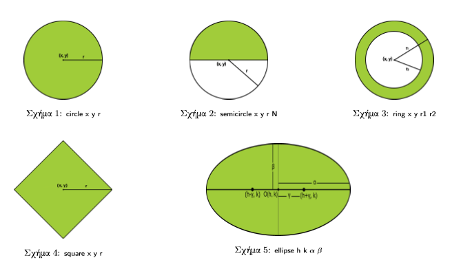

# 2D-Spatial-Queries
Five simple utilities that implement spatial queries in two-dimensional space

## Description
The goal of this work is to familiarize with the creation of process hierarchies using the fork() system call that in combination with the exec*() call can help differentiate and share work. In addition, arious system calls such as wait, mk fi fo, fread, fwrite, I / Os, simple synchronization, and communication between processes are being used.

## Compile
    $ make

## Run

    $ ./shapes -i InputBinaryFile -w WorkersCount -d TempDir

Command line options (in any order): 
* w : number of workers (must be greater than 2, see end of readme) 
* i : filename input 
* (optional) d : output file name 

Example:

    $ ./shapes -w 3 -i points_4000_gridsize_100.bin -d TempDir

## Implementation Notes

### Utilities

All utilities can be executed with the following arguments: 

    $ ./utilityX -i InputBinaryFile -o OutputFile -a UtilityArgs [-f Offset] [-n PointsToReadCount]

where: 
* utilityX is the one of the five utilities to implement; 
* InputBinaryFile is the binary file with the serialized data in fl oat, float, ... (no space or comma)
* OutputFile the output file that will contain in ASCII format the points that satisfy the query of each utility, with each point per line and its coordinates separated by TAB. 
* UtilityArgs the arguments of each utility (detailed below) separated by a blank space between them 
* The Offset is the number of bytes to be ignored at the beginning of the file. This parameter is optional and is therefore surrounded by parentheses [], 
* PointsToReadCount is the number of points (pairs of fl oat numbers) that the utility reads from the input file. This parameter is optional and is therefore surrounded by parentheses []

The -i / -o / -a / -f / -n flags can be used in any order in the program execution bar. Each of the utilities is further qualified by the -a parameter depending on its function, as follows: 

1. circle -a x y r 
Since the program is the circle, it is checked whether the entry point belongs to the circle ([x , y], r).
2. semicircle -a x y r N / S / W / E 
Since the program of use is the semicircle, it is checked whether the entry point belongs to the circle ([x, y], r), namely North, South, West, East semicircle. 
3. ring -a x y r1 r2 
If the utility is the ring, then each entry point is checked if it belongs to the ring ([x, y], r1, r2). 
4. square -a x y r 
If the utility is square then each entry point is checked if it belongs to the square ([x, y], r) which has a vertical and a horizontal diagonal. 
5. ellipse -a h k α β 
Since the program of use is the ellipse then each entry point is checked if it belongs to the shortage defined by the center C (h, k), it has a large axis x and y is small, and whose equation is the following: (x-h) 2 a2 + (y-k) 2 b2 = 1.
The order that the parameters provided in the above utilities are strict (ie, a sequence change implies a different two-dimensional space).

Below, you see the queries visualized in full correspondence with the list above:

 
### shapes.c

- When accepting a series of commands, the program keeps them in a 2D array.
- I tokenize every command(string) of this array (splitting it into tokens) and store it in a 3D array where every token is located in each cell.
- I create as many handlers as the commands that are received.
- If the number of given coordinates can be equally divided into the number of workers then it shall be done. Otherwise, each worker gets an extra pair of coordinates except for the last who gets less.
- Before the execution of the corresponding utility by the worker makes his fifo file and if he is the parent opens it for reading and waits for the utility to run. If he is a child then he runs the utility.
- When all the workers are finished then the handler collects the information from all fifos and writes them in a .out file (It could be done more efficiently by starting the collection of information from the worker's fifo who finished first with the help of his pid) .
- The gnuplot script creates the .png image in the directory that is located and the fifos are created in TempDir that has been given as an initial parameter.
- The program terminates with the execution of the exit command.
- With the execution of make clean command on the normal command line, executables are cleaned (like TempDir created from a previous run).	

### Note 

The program for w <= 2 does not work properly, freezing after the last worker is executed. For any other number and for any data the program works correctly.

### Output PNG's
This file has results for the following executions:
	
	6_image.png: ring 2 3 80 60 red;  				(gridsize 4000)
	7_image.png: circle 2 3 50 blue;  				(gridsize 4000)
	0_image.png: ellipse 2 3 1000 2000 green;			(gridsize 8000)
	2_image.png: semicircle 500 500 1000 N purple; 			(gridsize 8000)
	

## Hierarchy of Processes:

The hierarchy you has three levels and consists of the shapes Master (M), the shapes Handlers (H), and finally the Workers (W). Figure 6 shows an example of the hierarchy that the shapes program should create. The number of workers w each handler creates remains constant throughout the execution of the shapes and is set by a command line parameter. In the example of Figure 6, each H that oversees a type of query has created and 'guided' z-child processes (w = z) to simultaneously look at the data file data. 

The H0 handler uses the underlying workers so that the last all at the same time find the points belonging to a circle area. Similarly, H1 coordinates z workers to find squares and H2 employs workers to find points in a ring. The communication between the handlers and the workers regarding the results is done with named pipes. Each handler gathers the individual results each worker creates, and stores them in a temporary file that is ultimately made available to the master to create a graphical overall result.

## The Role of Processes at Each Level:

At this point we describe the specific role each process plays in the hierarchy as well as the relevant interfaces.

### shapes Master (M)
Your original program is this level and here the executable call is made with the following arguments: prompt> ./shapes -i InputBinaryFile -w WorkersCount -d TempDir where: - shapes is the executable - InputBinaryFile is the binary file with the input data serialized in fl oat, fl oat, ... (without a space or a comma), - WorkersCount is the number of w working nodes that will be used to create the process hierarchy. must be created by each shape Handler (H) node, - TempDir is a list that will use your program To temporarily store intermediate files (if it does not exist, it should be created).

The -i / -w / -d flags can be used in any order in the execution bar.

When the master is executed, it should first determine the number of file data. The master, in addition to the number of points, will need to calculate for each worker the position (o ff set) from which to start reading the file. Workers will have different O ff sets for the input file, but it is very likely that the latter logically has a smaller number of points to process (PointsToReadCount).

The M process supports a Command Line Interface (CLI) through which the user can enter specific utilities (one or more) to be executed and their associated arguments. The latter are available from the value (s) of the -a parameter. When a user is found in the CLI, he can either exit () and finish executing the shapes or accept commands in the following format: 
-> shape1 arg1 arg2 ... argN;
with shape1 being the program of use of our choice, arg1 arg2 ... argN are the required parameters, and the question mark? to indicate the end of the order.

The program should also support multi-utility group execution by separating the different comma-based commands by following the format:
-> shape1 arg11 arg12 ... arg1N, shape2 arg21 arg22 ... arg2M, .....;

For example, to perform a group query of a 'red' circle, an 'orange' square and a 'green' ring, we will insert the following: 
→ circle 3.0 2.2 5.0 red, square 3.0 3.8 2.5 orange, ring 5.0 5.0 4.0 4.5 green;
With the above command, the master will create three handlers each of which is responsible for executing each of these three utilities with the help of w workers.

Each time the CLI reads an input line, it can recognize the number of different commands to be executed, their usage program and their individual arguments. Then, you'll need to create the handlers that need the following parameters:
- the number of workers to be created
- which utility program to execute
- the individual parameters of the program of use (but not the color information). Specifically, these parameters are: InputBinaryFile, OutputFile, UtilityArgs, Offset, and PointsToReadCount.

### shapes Handler (H)

After preparing the parameters, the handler will create w workers. The latter, in turn, will execute their utility. For each of the workers, the handler will create a named pipe (FIFO), whose name will be passed as an output file parameter to the utility. The file (named named pipe) will be created in the temporary TempDir directory given to the shapes command line. Also, the FIFO name will follow the PIDparent contract wCount.fifo. For example, with w = 2, the handler with PID = 5000 will create two FIFOs with names: 5000 w0.fifo, 5000 w1.fifo. Next, it will pass the name of each named pipe (ie the OutputFile) to the corresponding worker running the utility as a file-output parameter.

The handler will wait for the workers to finish composing a temporary temporary file (located in the temporary directory) in an efficient way (that is, without having the handler wait for all his workers to quit before the result file is synthesized) . The name of the interim result file will follow the conventional SHPID.out format, where SHPID is the handler's PID. For example, the handler with PID = 5000 will create a 5000.out output file.

### Presentation of Final Result by the shapes Master (M) 

After waiting for all handlers to finish, the master can access the result of their execution through their temporary files. The master knows the PIDs of the handlers, and hence the names of all the intermediate result files he has to compose.

The master will create a gnuplot script file in the temporary directory. The file name will follow the CommandCount script.gnuplot where CommandCount is the serial number of each command received by the CLI. Gnuplot will visualize the results of the queries by inputting the script. The appendix provides basic information on the use of gnuplot in this case.

Once the visualization of the results with the gnuplot is complete, the master will be able to accept new commands again or finish. At the end of execution of the shapes, the contents of the temporary directory will be deleted.

